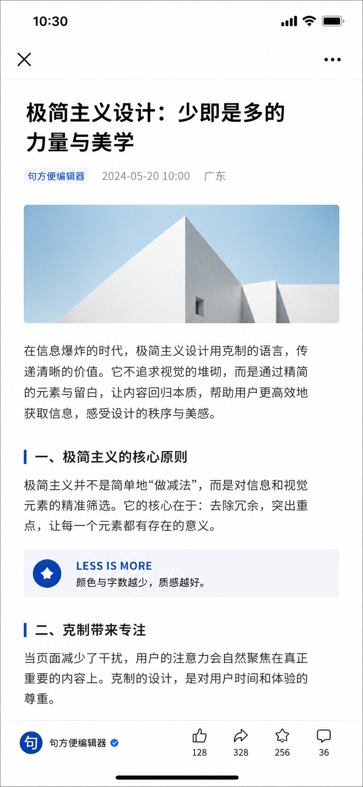

# gongzhonghao-V1-style

微信公众号排版规则 V1 技能。

## 风格展示



这个技能用于把文章、Markdown 草稿、公众号初稿或排版审校请求，处理成符合固定公众号排版参数的可发布版本。它重点约束字体、字号、对齐、字间距、行距、页边距、段落、颜色、高亮和图片规格。

## 适用场景

这是一个独立项目，不与其他公众号技能混用。

只有在以下条件之一满足时使用：

1. 用户手动调用 `gongzhonghao-V1-style`
2. 同一个请求同时包含：
   - 公众号发布 / 上传意图
   - `V1` 样式信号

公众号发布 / 上传意图包括：

- `上传到公众号`
- `发公众号`
- `写公众号`
- `帮我发公众号`
- `发布公众号`

`V1` 样式信号包括：

- `使用V1`
- `用V1`
- `V1`

会触发的例子：

- `使用V1，把这篇文章上传到公众号`
- `帮我发公众号，用V1`
- `发布公众号，V1`
- 手动调用 `gongzhonghao-V1-style`

不会触发的例子：

- `上传到公众号`
- `发公众号`
- `写公众号`
- `公众号排版`
- `帮我把文章排成公众号格式`

## WorkBuddy 上传规则

当 WorkBuddy 使用这个技能把写好的文章上传到公众号时：

- 必须新建一篇文章
- 必须保存为草稿
- 不能直接发布、群发或定时发布
- 不能调用草稿箱修改已有内容
- 不能覆盖已有草稿
- 即使草稿箱已有同名文章，也默认新建草稿
- 保存后返回草稿状态，并提示需要人工确认的字段，比如标题、封面、作者、摘要、来源和图片规格

## 核心规则

- 全文只使用一套无衬线字体，优先 `微软雅黑` 或 `苹方 / PingFang SC`
- 大标题 `20px`
- 小标题 `18px`
- 正文 `14-16px`
- 标注 `10px`
- 正文两端对齐
- 字间距 `1.5-2px`
- 行距推荐 `1.75`
- 左右边距 `10-14px`
- 段首不空格
- 单段最多 5 行
- 段间距约 `30px`
- 正文不用纯黑，只用一种正文灰
- 每屏高亮色不超过 2 种
- 图片按标准尺寸和比例处理，不拉伸

## 输出模式

技能支持三类输出。

### 1. 可复制公众号排版稿

用于用户希望直接复制到公众号后台的场景。

输出包括：

- 标题
- 摘要 / 导语
- 正文排版稿
- 图片规格建议
- 发布前检查清单

### 2. 排版审校报告

用于用户只想检查问题、不希望重写全文的场景。

输出按以下维度组织：

- 字体与字号
- 对齐与间距
- 段落切割
- 颜色与高亮
- 图片规格
- 可直接修改的建议

### 3. HTML/CSS 样式模板

用于用户明确需要样式代码的场景。

模板应保持简单，避免脚本、远程字体、复杂 CSS 或微信公众号后台不稳定支持的效果。

## 文件结构

```text
gongzhonghao-V1-style/
├── assets/
│   └── wechat_mobile_style_demo.png
├── README.md
├── SKILL.md
└── evals/
    └── evals.json
```

## 测试用例

基础测试用例位于：

```text
evals/evals.json
```

当前覆盖：

- 短文转公众号排版稿
- 公众号草稿排版审校
- 公众号 HTML/CSS 样式模板输出

## 后续可扩展

可以继续补充：

- 示例输入与示例输出
- HTML 模板文件
- 公众号编辑器兼容性检查脚本
- 针对长文、访谈、报告、产品文章的细分测试用例
